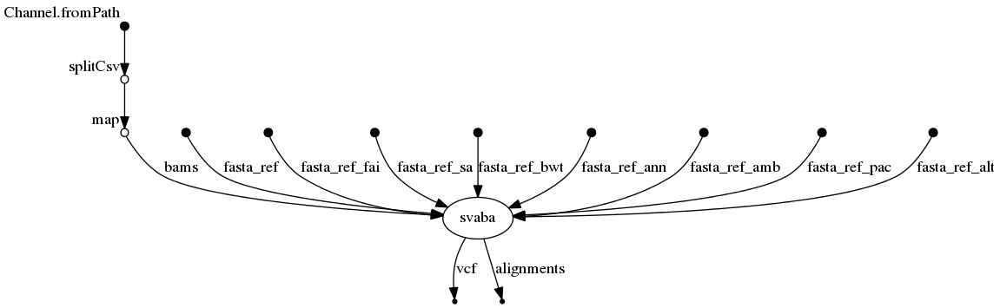

# svaba-nf
## Structural variant calling 

## Description ##

Perform structural variant calling with SvABA.

## Dependencies ## 

1. This pipeline is based on [nextflow](https://www.nextflow.io). As we have several nextflow pipelines, we have centralized the common information in the [IARC-nf](https://github.com/IARCbioinfo/IARC-nf) repository. Please read it carefully as it contains essential information for the installation, basic usage and configuration of nextflow and our pipelines.
2. SvABA: see official installation [here](https://github.com/walaj/svaba). 
## Input ## 

| Type      | Description     |
----------------- | ---------------
--input_folder    |  Folder containing normal (.normal.bam) and tumor (.tumor.bam) BAM files
--correspondance  |  A correspondance file, with columns `ID`, `tumor`, and `normal` specifying the name of the sample and the tumor/normal file names in the input folder

## Parameters
  * #### Mandatory

| Name      | Example value | Description     |
----------------- | --------------- | ---------------
--ref              | ref.fa |  Path to reference fasta file. It should be indexed

  * #### Optional
| Name      | Default value | Description     |
----------------- | --------------- | ---------------
--output_folder  | "."  |  Path to output folder
--dbsnp_file      |  dbsnp_indel.vcf | DbSNP file, e.g. available [here](https://data.broadinstitute.org/snowman/dbsnp_indel.vcf)
--cpu     | 1 |   Number of cpu to use 
--mem     | 4 |    Size of memory used in GB 
--targets      | NULL |         bed file with target positions
--options | NULL | List of options to pass to svaba

**Name**      | **Description**
------------- | -------------
--help        | Display help

## Download test data set ##

`git clone https://github.com/iarcbioinfo/data_test`

## Usage ##

`nextflow run IARCbioinfo/svaba-nf -r v1.0 -profile singularity--input_folder  path/to/input/ --svaba path/to/svaba/ --ref_file path/to/ref/ --dbsnp_file path/to/dbsnp_indel.vcf --output_folder /path/to/output` 

To run the pipeline without singularity just remove "-profile singularity". Alternatively, one can run the pipeline using a docker container (-profile docker).

### Tumor-only mode ###
To trigger the Tumor-only mode in some samples, put "None" (with capital N) in the normal column of the corresponding sample.

## Output ##

**Name**                   | **Description**
-------------------------- | --------------------------
txts (.bps.txt.gz)         |  Raw, unfiltered variants
BAMs (.contigs.bam)        |  Unsorted assembly contigs as aligned to the reference with BWA-MEM
Logs (.log)                |  Run-time information
txts (.discordants.txt.gz) |  Discordant reads identified with 2+ reads
VCFs (.vcf )               |  VCF of rearrangements and indels

## Directed Acyclic Graph

## Contributions

  | Name      | Email | Description     |
  |-----------|---------------|-----------------| 
  | Nicolas Alcala*    | AlcalaN@iarc.fr    | Developer to contact for support |
  | Tiffany Delhomme    |     DelhommeT@students.iarc.fr | Developer |
